# System Architecture — Visual Reference

Companion to [TECHNICAL_ARCHITECTURE.md](TECHNICAL_ARCHITECTURE.md). All diagrams are Mermaid.js and render natively in GitHub, VS Code, and most Markdown viewers.

---

## 1. System Overview

End-to-end view of all artifact layers, configuration, persistence, observability, and external dependencies. Designed to be fully self-contained — every defaulted threshold, protocol, schema, and data contract is annotated inline.

**Reading guide.** Subgraphs group concerns: ⚙ configuration · ▶ orchestration · 🧠 reasoning agents · 📦 retrieval / storage · 💾 persistence · 📊 evaluation · 📡 observability. Solid arrows are runtime calls (with payload type or HTTP body); dashed arrows are configuration injection, model weight loads, or optional/conditional paths.

```mermaid
graph TD
    %% ============================================================
    %% EXTERNAL ACTORS AND SERVICES
    %% ============================================================
    USER([User · CLI · Benchmark Driver<br/><i>python benchmark_datasets.py {ingest|evaluate|ablation|status|test}</i>])
    OLLAMA[["Ollama HTTP server @ localhost:11434<br/><b>nomic-embed-text</b> · 768-dim text embeddings (~250 MB)<br/><b>qwen2:1.5b</b> · 4-bit GGUF · ~1 GB RAM · 4096-token ctx<br/><b>alt models:</b> gemma2:2b · llama3.2:3b · phi3 · qwen3:4b"]]
    HF[["Hugging Face Hub (lazy load · HF_HUB_OFFLINE retry on failure)<br/><b>urchade/gliner_small-v2.1</b> · zero-shot NER<br/><b>Babelscape/rebel-large</b> · seq2seq RE<br/><b>cross-encoder/ms-marco-MiniLM-L-6-v2</b> · 22 MB reranker"]]
    SPACY[["SpaCy · en_core_web_sm<br/>tokeniser · POS · NER · dependency parser<br/><i>module-level singleton cache</i>"]]

    %% ============================================================
    %% CONFIGURATION (single source of truth)
    %% ============================================================
    subgraph CONFIG["⚙ Configuration · Single Source of Truth"]
        YAML[("config/settings.yaml<br/>YAML · loaded by _settings.py<br/>logs WARNING on missing keys<br/><i>no hardcoded values in production paths</i>")]
        CC["<b>ControllerConfig</b><br/>navigator + LLM defaults<br/>relevance_factor=0.6 · max_chunks=8<br/>contradiction_min=100 · reranker=on"]
        VC["<b>VerifierConfig</b><br/>max_iterations=1 · max_tokens=200<br/>max_context=3500 chars · max_docs=5<br/>entity_coverage_threshold=0.34"]
        APC["<b>AgentPipelineConfig</b><br/>enable_planner / enable_verifier<br/>FIFO cache · cache_max_size=1000"]
        RC["<b>RetrievalConfig</b><br/>vector_top_k=20 · graph_top_k=10<br/>bm25_top_k=20 · rrf_k=60<br/>cross_source_boost=1.2"]
        IC["<b>IngestionConfig</b><br/>chunking_strategy=sentence_spacy<br/>sentences_per_chunk=3 · overlap=1"]
        EXC["<b>ExtractionConfig</b><br/>GLiNER conf=0.15 · 13 entity types<br/>REBEL: ≥2 entities required<br/>num_beams=5 · device=cpu"]
        YAML -->|"from_yaml()"| CC
        YAML -->|"from_yaml()"| VC
        YAML -->|"from_yaml()"| APC
        YAML -->|"factory"| RC
        YAML -->|"factory"| IC
        YAML -->|"factory"| EXC
    end

    %% ============================================================
    %% PIPELINE LAYER · Orchestration
    %% ============================================================
    subgraph PIPE["▶ Pipeline Layer · Orchestration"]
        AP["<b>AgentPipeline</b><br/>━━━━━━━━━━━━━━━━━━━<br/>Single-pass S_P → S_N → S_V chain<br/>Lazy agent instantiation on first process()<br/>Per-stage wall-clock timing tracking<br/>process(query) → PipelineResult<br/><i>No outer retry loop · self-correction lives in S_V</i>"]
        AC["<b>AgenticController</b> · alt orchestrator<br/>━━━━━━━━━━━━━━━━━━━<br/>LangGraph StateGraph (sequential fallback if absent)<br/>AgentState (TypedDict) carries shared state<br/><b>Iterative multi-hop:</b> activates when any HopStep.depends_on is set<br/>Bridge entity extraction (surname-anchor regex, ≤3/step)"]
        IP["<b>IngestionPipeline</b><br/>━━━━━━━━━━━━━━━━━━━<br/>Documents → Chunks → Entities → Vectors → Stores<br/>Multi-format DocumentLoader: TXT · JSON · JSONL · MD · PDF<br/>IngestionMetrics(chunks_added, entities_added, relations_added, time_ms)"]
        FIFO[("FIFO Result Cache<br/>SHA-256(query) keyed<br/>cache_max_size=1000<br/><i>oldest evicted first</i>")]
    end

    %% ============================================================
    %% LOGIC LAYER · Artifact B (3 reasoning agents)
    %% ============================================================
    subgraph LOGIC["🧠 Logic Layer · Artifact B"]
        SP{{"<b>S_P · Planner</b> (rule-based · &lt;10 ms)<br/>━━━━━━━━━━━━━━━━━━━<br/>1. Classify query type:<br/>  SINGLE_HOP · MULTI_HOP · COMPARISON ·<br/>  TEMPORAL · AGGREGATE · INTERSECTION<br/>2. Extract entities (SpaCy NER · conf ≥ 0.7)<br/>3. Decompose multi-hop:<br/>  · Pattern C: 'for a/an [film|movie|show]'<br/>  · Pattern D: '[role] with [qualif] co-wrote/directed'<br/>  · Pattern E: 'the [role] of [Entity]' (relational anchor)<br/>4. Strategy selection: VECTOR_ONLY · GRAPH_ONLY · HYBRID<br/>→ <b>RetrievalPlan</b>{type, strategy, entities, hop_sequence[]}"}}
        SN{{"<b>S_N · Navigator</b> (~120–280 ms incl. all 3 lanes)<br/>━━━━━━━━━━━━━━━━━━━<br/>For each sub-query: dispatch to HybridRetriever<br/>RRF fusion across sub-queries (cross-query corroboration boost)<br/>━━ <b>Stage 2.5 · Cross-encoder rerank</b> (opt) ━━<br/><b>6-stage filter chain:</b><br/>1. Relevance: rrf_score ≥ 0.6 × max_score<br/>2. Redundancy: Jaccard token-set < 0.8<br/>3. Contradiction: numeric (overlap>0.3 · ratio>2.0 · min≥100)<br/>4. Entity-overlap pruning: drop strict-subset chunks<br/>5. Entity-mention: ≥1 query entity (multi-word: ≥8 chars · single: ≥5)<br/>6. Context shrinkage: ≤800 chars/chunk · sentence-aware<br/>→ <b>NavigatorResult</b>{filtered_context, scores, metadata}"}}
        SV{{"<b>S_V · Verifier</b> (~200 ms – 60 s · LLM-bound)<br/>━━━━━━━━━━━━━━━━━━━<br/><b>Pre-validation:</b><br/>· Entity-path coverage ≥ 0.34 (KuzuDB multi-hop · substring fallback)<br/>· Numeric contradiction (NLI cross-encoder disabled by default · 270 MB)<br/>· Source credibility = 0.4·xref + 0.3·entity_freq + 0.3·provenance<br/><b>Question-relevance reorder</b> (counters position bias of small LLMs)<br/><b>Build context</b>: ≤5 docs · ≤3500 chars · ≤800 chars/doc<br/><b>Generate</b> @ qwen2:1.5b · temp=0.0 · max_tokens=200<br/>Self-correction loop: max_iterations=1 (opt-in to ≥2 for ablation)<br/>→ <b>VerificationResult</b>{answer, confidence: HIGH|MEDIUM|LOW, sources}"}}
    end

    %% ============================================================
    %% DATA LAYER · Artifact A (retrieval + storage primitives)
    %% ============================================================
    subgraph DATA["📦 Data Layer · Artifact A"]
        HR["<b>HybridRetriever</b><br/>retrieve(query, entity_hints=None)<br/>→ (List[RetrievalResult], RetrievalMetrics)<br/>Modes: VECTOR · GRAPH · HYBRID (default)<br/><i>entity_hints bypass query-time GLiNER for short bridge sub-queries</i>"]
        QNER["<b>ImprovedQueryEntityExtractor</b><br/>Fallback chain: GLiNER (conf ≥ 0.2)<br/>→ SpaCy NER → regex<br/>process-level GLiNER cache (~7.5 s cold · &lt;1 ms hot)<br/><i>Same 13 types as ingestion (consistency)</i>"]
        RRF["<b>RRFFusion</b> · rank-based, no normalisation<br/>RRF(d) = Σᵣ 1/(k + rankᵣ(d)) + BONUS<br/>k=60 · BONUS = 1.2/(k+1) per shared lane pair<br/><i>Robust to nomic-embed score compression (0.74–0.78)</i>"]
        BM25["<b>BM25 lane</b> (rank_bm25 · pure Python)<br/>Lazy index from cached LanceDB DataFrame<br/>Score normalised → [0,1] for clean RRF integration<br/>top-20 candidates per query<br/><i>Surfaces exact-match queries that embed poorly</i>"]
        HS["<b>HybridStore</b> · unified façade<br/>add_documents() · vector_search() · graph_search() · close()"]
        VS["<b>VectorStoreAdapter</b><br/>LanceDB wrapper · cosine distance<br/>distance→similarity conversion<br/>IVF-Flat ANN · overfetch_factor=3"]
        GS["<b>KuzuGraphStore</b><br/>Cypher · BFS multi-hop ≤ 2 hops<br/>_name_variants() · last-name fallback for ≤3-char first names<br/>find_chunks_by_entity_multihop()"]
        EM["<b>BatchedOllamaEmbeddings</b><br/>LangChain Embeddings interface<br/>Batched: ⌈N/batch_size⌉ HTTP calls · batch=64<br/>timeout=60s<br/>EmbeddingMetrics: hit_rate, batch_count, total_ms"]
        EXT["<b>EntityExtractionPipeline</b><br/>GLiNER NER (13 types · conf ≥ 0.15 · batch=16)<br/>→ REBEL RE (only if ≥2 entities · ~60% compute reduction)<br/>2-tier cache: in-mem LRU + SQLite<br/>Keyed by (text_hash, model_name) — model change auto-invalidates<br/>Fallback chain: GLiNER → SpaCy → regex"]
        CK["<b>SpacySentenceChunker</b><br/>3-sentence sliding window · overlap=1<br/>Deterministic SHA-256 chunk IDs (idempotent re-ingestion)<br/>min_chunk_chars=50 · max_chunk_chars=2000"]
    end

    %% ============================================================
    %% PERSISTENCE · Embedded (no server processes)
    %% ============================================================
    subgraph PERS["💾 Embedded Persistence · No Server Required"]
        LD[("<b>LanceDB</b> · ./data/&lt;dataset&gt;/vector/<br/>Apache Arrow columnar format<br/>Schema: document_id · text · vector(768) · metadata{source_file, chunk_index, page_number}<br/>cosine distance · IVF-Flat ANN · top_k_vectors=20<br/><i>L2 default OVERRIDDEN to cosine — required for normalised text embeddings</i>")]
        KZ[("<b>KuzuDB</b> · ./data/&lt;dataset&gt;/graph/<br/>Property graph · native Cypher<br/><b>Nodes:</b> DocumentChunk(chunk_id, text, page, idx, source) · SourceDocument(doc_id, filename, pages) · Entity(entity_id, name, type, conf)<br/><b>Edges:</b> FROM_SOURCE · NEXT_CHUNK · MENTIONS · RELATED_TO(rel_type, conf)<br/>max_hops=2 · ~10–100× faster than NetworkX")]
        EC[("<b>Embedding Cache</b> · ./cache/embeddings.db<br/>SQLite WAL mode<br/>PK: text_hash (SHA-256)<br/>Indexed by (model_name, text_hash) — model change auto-invalidates<br/>Cache hit rate > 95% on re-evaluation")]
        ENC[("<b>Entity Cache</b> · ./data/entity_cache.db<br/>SQLite + in-memory LRU (max 10k)<br/>Keyed by (text_hash, model_name)")]
    end

    %% ============================================================
    %% EVALUATION LAYER · Artifact C
    %% ============================================================
    subgraph EVAL["📊 Evaluation · Artifact C"]
        BD["<b>benchmark_datasets.py</b><br/>CLI: ingest · evaluate · ablation · status · test<br/>Per-dataset isolated stores (no cross-dataset leakage)"]
        HE["<b>HotpotQAEvaluator</b><br/>evaluate(n_samples) → EvalSummary<br/>Per-type and per-level breakdowns"]
        AS["<b>AblationStudy</b><br/>Multi-config matrix runner<br/>seed=42 (random + numpy at module import)<br/>Output: config.json · raw_results.json · summary.csv ·<br/>per_question.csv · report.md · latex_tables.tex"]
        MET["<b>metrics.py</b> · canonical EM / F1<br/>HotpotQA-compatible normaliser<br/>(lowercase · strip articles · remove punct · collapse ws)<br/>F1 = multiset token intersection · 2PR/(P+R)"]
        DIAG["<b>Diagnostic tools</b><br/>diagnose.py · diagnose_verbose.py · diagnose_ingestion.py<br/>Monkey-patch Navigator filters · gold-survival tracking per stage<br/><i>Part of system surface — breaking changes blocked</i>"]
    end

    %% ============================================================
    %% DATASETS (HuggingFace)
    %% ============================================================
    subgraph DS["📚 Datasets · HuggingFace"]
        HQ[/"<b>HotpotQA</b> · multi-hop (2 docs)<br/>distractor split · validation"/]
        WK[/"<b>2WikiMultiHopQA</b><br/>2 Wikipedia articles · validation"/]
        SQ[/"<b>StrategyQA</b><br/>boolean implicit reasoning · train"/]
    end

    %% ============================================================
    %% OBSERVABILITY (cross-cutting)
    %% ============================================================
    subgraph OBS["📡 Observability · Cross-cutting"]
        LOG["<b>logging.getLogger(__name__)</b><br/>format + level from settings.yaml → logging<br/>file: ./logs/edge_rag.log"]
        FBW["<b>FALLBACK ACTIVE warnings</b><br/>· GLiNER → SpaCy/regex<br/>· LangGraph absent → sequential controller<br/>· Ollama unreachable → wrapped RuntimeError<br/>· LangChain absent → minimal Document shim"]
        MET2["<b>Metrics surfaces</b><br/>RetrievalMetrics (per-lane counts + timings)<br/>EmbeddingMetrics (cache hit rate, batch count)<br/>PipelineResult.stage_timings · AgentState.stage_timings"]
    end

    %% ============================================================
    %% RUNTIME DATA FLOW · Query path
    %% ============================================================
    USER -->|"query: str"| AP
    AP -.->|"SHA-256(query) lookup"| FIFO
    AP -->|"plan(query: str)"| SP
    SP -->|"<b>RetrievalPlan</b><br/>{query_type, strategy, entities[],<br/>hop_sequence[HopStep], sub_queries[]}"| SN
    SN -->|"<b>NavigatorResult</b><br/>{filtered_context: List[str],<br/>raw_context, scores, metadata}"| SV
    SV -->|"<b>VerificationResult</b><br/>{answer, confidence,<br/>iterations, sources}"| AP
    AP -->|"<b>PipelineResult</b> (JSON)<br/>{answer, per-stage timings,<br/>cached_result}"| USER

    %% Alt orchestrator
    AC -.->|"alt entry point<br/>iterative bridge resolution"| SP
    AC -.->|"_iterative_navigator_node"| SN
    AC -.-> SV

    %% Data layer wiring
    SN -->|"retrieve(sub_query,<br/>entity_hints=List[str])"| HR
    HR --> QNER
    HR -->|"vector_search(emb, top_k=20)"| HS
    HR -->|"graph_search(entities,<br/>max_hops=2)"| HS
    HR --> BM25
    HR --> RRF

    HS --> VS
    HS --> GS
    VS -->|"Apache Arrow batch"| LD
    GS -->|"Cypher · BFS"| KZ
    BM25 -.->|"lazy corpus index"| LD

    %% External LLM calls
    EM -->|"<b>HTTP POST /api/embeddings</b><br/>{model, prompt: List[str]}<br/>batched in 64-text chunks"| OLLAMA
    EM <-->|"SHA-256 PK lookup<br/>(model_name, text_hash)"| EC
    SV -->|"<b>HTTP POST /api/generate</b><br/>{model, prompt, options:{temp, max_tokens}}<br/>timeout=60 s · ~8–15 tok/s on CPU"| OLLAMA
    SP -.->|"NER + dependency parse"| SPACY
    QNER -.->|"NER fallback"| SPACY
    QNER -.->|"GLiNER weights<br/>(HF_HUB_OFFLINE retry on net failure)"| HF
    SN -.->|"Stage 2.5 cross-encoder<br/>~30 ms/pair on CPU"| HF

    %% ============================================================
    %% INGESTION PATH
    %% ============================================================
    DS -->|"HuggingFace datasets API"| BD
    BD --> IP
    IP --> CK
    IP --> EXT
    IP --> EM
    IP -->|"add_documents(docs, embeddings)"| HS
    EXT <-->|"keyed (text_hash, model)"| ENC
    EXT -.->|"GLiNER + REBEL weights"| HF

    %% ============================================================
    %% EVALUATION PATH
    %% ============================================================
    BD --> AS
    BD --> HE
    AS -->|"create_full_pipeline()"| AP
    HE -->|"create_full_pipeline()"| AP
    AS --> MET
    HE --> MET
    BD -.-> DIAG

    %% ============================================================
    %% CONFIG WIRING (dashed · low visual weight)
    %% ============================================================
    YAML -.->|"_load_settings()"| AP
    YAML -.->|"_load_settings()"| AC
    YAML -.->|"_load_settings()"| IP
    CC -.-> SN
    VC -.-> SV
    APC -.-> AP
    RC -.-> HR
    EXC -.-> EXT
    IC -.-> CK
    IC -.-> IP

    %% ============================================================
    %% OBSERVABILITY WIRING (dotted)
    %% ============================================================
    AP -.-> LOG
    SP -.-> LOG
    SN -.-> LOG
    SV -.-> LOG
    SN -.-> MET2
    EM -.-> MET2
    HR -.-> MET2
    QNER -.-> FBW
    EXT -.-> FBW
    SV -.-> FBW

    %% ============================================================
    %% STYLING
    %% ============================================================
    classDef external fill:#fff4d6,stroke:#b88500,stroke-width:2px,color:#000
    classDef database fill:#dbeeff,stroke:#1f6feb,stroke-width:2px,color:#000
    classDef cache fill:#e8f5e9,stroke:#2e7d32,stroke-width:1.5px,color:#000
    classDef agent fill:#f3e8ff,stroke:#6f2da8,stroke-width:2px,color:#000
    classDef pipeline fill:#ffe9ec,stroke:#c2185b,stroke-width:2px,color:#000
    classDef store fill:#e0f7fa,stroke:#00838f,stroke-width:1.5px,color:#000
    classDef eval fill:#f5f5f5,stroke:#424242,stroke-width:1.5px,color:#000
    classDef config fill:#fff8e1,stroke:#f57f17,stroke-width:1.5px,color:#000
    classDef obs fill:#eceff1,stroke:#455a64,stroke-width:1px,color:#000,stroke-dasharray: 3 3
    classDef ds fill:#fafafa,stroke:#616161,stroke-width:1px,color:#000,stroke-dasharray: 4 2
    classDef user fill:#fff,stroke:#000,stroke-width:2px,color:#000

    class USER user
    class OLLAMA,HF,SPACY external
    class LD,KZ database
    class EC,ENC,FIFO cache
    class SP,SN,SV agent
    class AP,AC,IP pipeline
    class HR,HS,VS,GS,EM,EXT,CK,RRF,BM25,QNER store
    class BD,HE,AS,MET,DIAG eval
    class YAML,CC,VC,APC,RC,IC,EXC config
    class LOG,FBW,MET2 obs
    class HQ,WK,SQ ds
```

### Diagram Legend

| Shape / colour | Meaning |
|---|---|
| White stadium (USER) | Human or programmatic entry point |
| Yellow stadium (`[[ ]]`) | External service / process (Ollama, HF Hub, SpaCy) |
| Blue cylinder (`[( )]`) | Embedded primary database (LanceDB, KuzuDB) |
| Green cylinder | Cache (SQLite WAL or in-memory FIFO/LRU) |
| Purple hexagon (`{{ }}`) | Reasoning agent (S_P, S_N, S_V) |
| Pink rectangle | Pipeline / orchestrator (AgentPipeline, AgenticController, IngestionPipeline) |
| Cyan rectangle | Data-layer primitive (retriever, store, embedder, chunker, extractor) |
| Yellow rectangle | Configuration source (settings.yaml + dataclasses) |
| Grey dotted | Observability / cross-cutting (logging, fallbacks, metrics) |
| Grey trapezoid (`[/ /]`) | Dataset / external data source |

### Key Invariants Visible in the Diagram

1. **Configuration flows downward only.** `settings.yaml` is loaded once and injected into typed dataclasses; no production code path hard-codes a parameter.
2. **Layer dependency direction** is strictly `evaluations → pipeline → logic_layer → data_layer → persistence`. No reverse arrow exists in the diagram — any future addition that crosses upward is a layering violation.
3. **All external I/O is dashed or marked with HTTP body.** The only network boundary is `localhost:11434` (Ollama) and HF Hub for one-time model loads.
4. **Caches are bypassed transparently on miss.** Both the embedding cache (SQLite) and the FIFO result cache fall through to the primary path — they never block correctness.
5. **The Verifier owns generation and self-correction.** `AgentPipeline.process()` calls `generate_and_verify()` exactly once; the loop is internal to S_V, controlled by `agent.max_verification_iterations`.
6. **Filtering is a Logic Layer concern.** The data layer returns ranked candidates; curation happens in the Navigator's six-stage chain, not in the retriever.

---

## 2. Query Lifecycle

Full sequence trace of a query through all conditional branches: cache hit, six query types, three multi-hop decomposition patterns, iterative bridge resolution, three retrieval lanes, optional cross-encoder reranking, the six-stage filter chain with safety fallback, three pre-validation outcomes, the optional self-correction loop, and the Ollama timeout branch. Every branch is annotated with the configuration key that gates it. Numbers in `~ms` are CPU-only on the reference edge target.

```mermaid
sequenceDiagram
    autonumber
    actor U as User / Benchmark
    participant AP as AgentPipeline.<br/>process(query)
    participant FC as FIFO cache<br/>SHA-256 keyed
    participant SP as S_P · Planner<br/>(SpaCy rules)
    participant SN as S_N · Navigator
    participant HR as HybridRetriever
    participant LD as LanceDB<br/>(vector ANN)
    participant BM as BM25 lane<br/>(rank_bm25)
    participant KZ as KuzuDB<br/>(graph BFS)
    participant CE as Cross-encoder<br/>(opt · ms-marco)
    participant SV as S_V · Verifier
    participant OL as Ollama<br/>localhost:11434
    participant LOG as logger / metrics

    U->>+AP: process(query: str)
    AP->>FC: lookup SHA-256(normalized query)

    alt cache HIT  (gate: agent.enable_caching = true)
        FC-->>AP: cached PipelineResult
        AP-->>U: PipelineResult { cached_result = True }
        Note right of AP: Pipeline bypassed entirely (< 1 ms).<br/>Heavily exercised during ablation runs<br/>where the same query is executed under<br/>different retrieval-mode configurations.

    else cache MISS  (full pipeline)
        AP->>+SP: plan(query)
        Note over SP: SpaCy parse → Matcher rules<br/>~5–10 ms · zero LLM calls
        SP->>SP: classify() → QueryType<br/>Six types, rule-based, deterministic
        SP->>SP: extract_entities()<br/>SpaCy NER · conf ≥ planner.min_entity_confidence (0.7)

        alt query_type == COMPARISON
            SP->>SP: _decompose_comparison()<br/>via _ATTR_MAP regex table
            Note right of SP: Eight rewrite patterns:<br/>"same nationality" → 2 sub-queries:<br/>"What is the nationality of {entity}?"<br/>per entity. The redundant 3rd<br/>"Were both ..." sub-query is intentionally<br/>NOT generated (would embed near-identical<br/>and waste context budget).

        else query_type == MULTI_HOP & Pattern C matches
            SP->>SP: split on "for a/an/the [film|movie|show|...]"<br/>HopStep[0].is_bridge = True<br/>HopStep[1].depends_on = [0]
            Note right of SP: Bridge is the work, retrieved first.<br/>HopStep[0] surface form names the bridge work.

        else query_type == MULTI_HOP & Pattern D matches
            SP->>SP: split on "[role] with [qualif] co-wrote/directed/..."<br/>HopStep[0].is_bridge = True
            Note right of SP: Bridge is the work, not the person<br/>(qualifier disambiguates the role).

        else query_type == MULTI_HOP & Pattern E (relational anchor)
            SP->>SP: detect "the [role] of [Entity]"<br/>HopStep[0]: "Who is the {role} of {anchor}?"<br/>HopStep[1]: original query, depends_on = [0]
            Note right of SP: Pattern E only fires as fallback after<br/>Patterns C and D miss. Role vocabulary<br/>= _RELATIONAL_ANCHOR_ROLES (~25 nouns).<br/>Fixes "father of X / wife of X / founder of X"<br/>where bridge entity is implied, not named.

        else SINGLE_HOP / unclassified
            SP->>SP: hop_sequence = [HopStep(0, query, depends_on=[])]
        end

        SP-->>-AP: RetrievalPlan {<br/>  query_type, strategy,<br/>  entities[EntityInfo],<br/>  hop_sequence[HopStep], sub_queries[]<br/>}

        AP->>+SN: navigate(plan, retriever)

        alt iterative path  (any HopStep.depends_on non-empty AND len > 1)
            Note over SN: Triggered automatically by the Navigator's<br/>has_bridge_deps check. Required because<br/>the bridge entity is unknown at query time<br/>and must be discovered LIVE from hop 0.
            SN->>SN: sort hops by step_id<br/>current_hints = plan.entities (SpaCy-extracted)

            loop for each step in sorted_hops  (max 3 hops, safety bound)
                SN->>+HR: retrieve(step.sub_query,<br/>entity_hints=current_hints)

                par 3-lane parallel retrieval
                    HR->>+LD: vector_search(emb, top_k=20)
                    Note right of LD: nomic-embed-text → 768-dim<br/>cosine · IVF-Flat<br/>~30–60 ms · score in [0,1]
                    LD-->>-HR: List[{document_id, text, similarity, metadata}]
                and
                    HR->>+BM: bm25_search(query, top_k=20)
                    Note right of BM: rank_bm25 over cached LanceDB DataFrame.<br/>Index built lazily on first call.<br/>~5–20 ms · score normalised to [0,1]<br/>(gated by rag.enable_bm25)
                    BM-->>-HR: List[{chunk_id, text, bm25_score}]
                and
                    HR->>+KZ: graph_search(entity_hints,<br/>max_hops=2)
                    Note right of KZ: _name_variants() heuristic:<br/>last-name fallback when first name ≤ 3 chars,<br/>plus individual tokens ≥ 4 chars.<br/>~1–30 ms (varies by graph density)
                    KZ-->>-HR: List[{chunk_id, text, hops, matched_entity}]
                end

                HR->>HR: RRFFusion.fuse()<br/>RRF(d) = Σᵣ 1/(60 + rankᵣ(d)) + BONUS
                Note right of HR: BONUS = 1.2/(k+1) per shared lane pair.<br/>Rank-based — robust to score compression<br/>of nomic-embed-text (most pairs 0.74–0.78).<br/>Self-loops and single-lane chunks handled cleanly.
                HR-->>-SN: List[RetrievalResult] (with per-lane scores + ranks)

                opt step.is_bridge == True
                    SN->>SN: _extract_bridge_entities(<br/>chunks, exclude=query_tokens)
                    Note right of SN: Pass 1: surname-anchor regex over all chunks<br/>(rejects "[About: …]" annotation artifacts<br/>via the ":" guard).<br/>Pass 2: capitalised multi-word phrases.<br/>Returns ≤ 3 candidates ranked by frequency.

                    alt extraction yielded entities
                        SN->>SN: current_hints += bridge_entities<br/>(capped at 3 per step)
                    else extraction returned empty
                        Note right of SN: Fallback: keep prior current_hints.<br/>Graceful degradation to single-hop behaviour<br/>so a missed bridge never empties the context.
                    end
                end

                SN->>SN: accumulated_chunks += dedup_by_chunk_id(results)
            end

        else simple path  (no bridge dependencies)
            SN->>SN: current_hints = plan.entities
            Note over SN: All sub-queries dispatched independently.<br/>RRF fusion within each sub-query AND across<br/>sub-queries (cross-query corroboration boost).

            par dispatch every sub_query
                SN->>HR: retrieve(sub_query, hints)
                HR-->>SN: List[RetrievalResult]
            end
        end

        opt navigator.enable_reranker == true
            SN->>+CE: rerank top reranker_top_k chunks<br/>by CrossEncoder.predict([(query, chunk)])
            Note right of CE: cross-encoder/ms-marco-MiniLM-L-6-v2<br/>22 MB · ~30 ms/pair on CPU · lazy-loaded.<br/>On ImportError or load failure: sets self._reranker=False<br/>and reverts to pure RRF order. Original rrf_score<br/>preserved on each result for downstream use.
            CE-->>-SN: re-ordered List[RetrievalResult]
        end

        Note over SN: 6-stage pre-generative filter chain<br/>(deterministic · pure Python · < 6 ms total)
        SN->>SN: 1 · Relevance: rrf_score ≥ 0.6 × max_score
        SN->>SN: 2 · Redundancy: drop if Jaccard token-set > 0.8
        SN->>SN: 3 · Contradiction: numeric heuristic<br/>(overlap > 0.3 AND ratio > 2.0 AND min ≥ 100)
        SN->>SN: 4 · Entity-overlap pruning:<br/>drop if entity-set ⊂ higher-ranked chunk
        SN->>SN: 5 · Entity-mention: ≥ 1 query entity literal<br/>(multi-word: full phrase OR token ≥ 8 chars,<br/>single-token: length ≥ 5)

        alt Filter 5 would empty the context
            Note right of SN: Safety fallback: return all chunks unchanged.<br/>The pipeline guarantees filtered_context is<br/>NEVER empty — INSUFFICIENT context is decided<br/>downstream by S_V's pre-validation, not here.
        end

        SN->>SN: 6 · Context shrinkage: ≤ max_chars_per_doc<br/>(default 800) · sentence-aware truncation
        SN-->>-AP: NavigatorResult {<br/>  filtered_context: List[str],<br/>  raw_context, scores, metadata<br/>}

        AP->>+SV: generate_and_verify(query, context)
        SV->>SV: pre_validate(context, query)
        Note over SV: Three checks (some can be disabled in YAML):<br/>(a) Entity-path coverage ≥ 0.34<br/>(b) Numeric contradiction (NLI is OFF by default)<br/>(c) Source credibility:<br/>    0.4·xref + 0.3·entity_freq + 0.3·provenance

        alt pre_validation.status == INSUFFICIENT
            Note right of SV: Triggered when entity coverage too low,<br/>no chunks survived, or all flagged conflicting.<br/>NO Ollama call is made — saves 5–60 s on CPU.
            SV-->>AP: VerificationResult {<br/>  answer = "I cannot determine the answer from the provided context.",<br/>  confidence = LOW, iterations = 0<br/>}

        else status == VALID or AMBIGUOUS  (proceed to generation)
            SV->>SV: _reorder_by_question_relevance(query, context)
            Note over SV: Stable-sort context by query content-word overlap.<br/>Counters small-LLM position bias — qwen2:1.5b<br/>strongly favours the first plausible entity it sees.<br/>RRF scores are PRESERVED; only display order changes.

            SV->>SV: build_context()<br/>≤ llm.max_docs (5) ·<br/>≤ llm.max_chars_per_doc (800) ·<br/>≤ llm.max_context_chars (3500) total

            SV->>+OL: HTTP POST /api/generate<br/>{ model: qwen2:1.5b, prompt, options }<br/>temperature = 0.0 (deterministic) ·<br/>max_tokens = 200 · timeout = 60 s
            Note over OL: ~8–15 tok/s on CPU.<br/>~875-token context typical → 30–55 s wall-clock.<br/>Allocates the full 4096-token KV-cache regardless<br/>of prompt length (Ollama implementation detail).

            alt response within 60 s
                OL-->>SV: complete answer text
            else Ollama timeout (HTTP 60 s)
                OL-->>SV: partial output
                SV->>LOG: WARNING · partial answer used
                Note right of LOG: Timeout is a hard boundary —<br/>NO retry. Partial output is returned<br/>and confidence usually drops to LOW.
            end

            SV->>SV: _extract_claims(answer)<br/>_verify_claims(claims, context)

            opt verifier.max_iterations > 1  (self-correction · default = 1 = OFF)
                Note over SV: Default disables the loop entirely.<br/>Self-Refine (Madaan 2023) reproduces on GPT-3.5+<br/>but on a 1.5 B SLM the second pass typically<br/>injects hallucinations rather than corrects.<br/>Set agent.max_verification_iterations = 2 only<br/>for ablation comparison runs.

                loop while violations remain AND iter < max_iterations
                    SV->>OL: POST /api/generate with CORRECTION_PROMPT<br/>{ violations as feedback }
                    OL-->>SV: refined answer
                    SV->>SV: _verify_claims(refined, context)
                end
            end

            SV->>SV: confidence =<br/>HIGH if verified_ratio ≥ 0.8<br/>MEDIUM if verified_ratio ≥ 0.5<br/>LOW otherwise
            OL-->>-SV: 

            SV-->>-AP: VerificationResult {<br/>  answer, confidence,<br/>  iterations, sources,<br/>  self_corrections<br/>}
        end

        AP->>FC: write entry  (FIFO eviction at cache_max_size)
        AP-->>-U: PipelineResult {<br/>  answer, confidence, query,<br/>  per-stage timings (ms),<br/>  cached_result = False<br/>}
    end
```

### Trigger Reference

Every conditional branch in the diagram, mapped to the configuration key or runtime predicate that activates it.

| Trigger / Predicate | Branch taken | Effect |
|---|---|---|
| `agent.enable_caching = true` AND SHA-256(query) in FIFO | **cache HIT** | Skip pipeline entirely; return cached PipelineResult in < 1 ms |
| `agent.enable_planner = false` | passthrough plan | A trivial RetrievalPlan(HYBRID, MULTI_HOP) is used; S_P is bypassed |
| `query_type == COMPARISON` | `_decompose_comparison()` | Two factual sub-queries via `_ATTR_MAP`; the redundant rephrased original is intentionally omitted |
| Pattern C regex matches | bridge decomposition C | `for a/an/the [film\|movie\|...]` — bridge is the work |
| Pattern D regex matches | bridge decomposition D | `[role] with [qualif] co-wrote/directed` — bridge is the work, not the person |
| Pattern E regex matches (after C, D fail) | relational-anchor decomposition | `the [role] of [Entity]` → `"Who is the {role} of {anchor}?"` |
| All decomposition patterns fail | single-hop fallback | `hop_sequence = [HopStep(0, query, depends_on=[])]` |
| Any `HopStep.depends_on` non-empty AND `len(hops) > 1` | **iterative path** | Sequential hops; bridge entity extraction between hops |
| `step.is_bridge == True` after retrieval | bridge entity extraction | Surname-anchor regex → multi-word capitalised regex; ≤ 3 entities added to hints |
| Bridge extraction returns empty | hint preservation fallback | Keep prior `current_hints`; degrade gracefully to single-hop |
| `rag.enable_bm25 = true` | BM25 lane active | Third RRF lane; index lazy-built on first call |
| `navigator.enable_reranker = true` | Stage 2.5 reranker | Cross-encoder re-orders top-K before relevance filter |
| Cross-encoder import / load fails | reranker disabled silently | `self._reranker = False`; reverts to pure RRF order |
| Filter 5 would drop every chunk | safety fallback | Return all chunks; INSUFFICIENT is decided by S_V, not S_N |
| `pre_validation.status == INSUFFICIENT` | early-return | Return canned "I cannot determine…" answer; **NO Ollama call** |
| Ollama call exceeds `llm.timeout` (60 s) | timeout branch | Partial output returned; WARNING logged; no retry |
| `verifier.max_iterations > 1` AND violations remain | self-correction loop | Re-prompt with violations as feedback (off by default) |
| `verified_ratio ≥ 0.8` | confidence | **HIGH** |
| `0.5 ≤ verified_ratio < 0.8` | confidence | **MEDIUM** |
| `verified_ratio < 0.5` | confidence | **LOW** |
| `agent.enable_verifier = false` | verifier bypass | Top retrieved chunk returned directly as the answer (ablation only) |

### Configuration → Behaviour Map

The settings.yaml keys that gate or parameterise the lifecycle.

| `settings.yaml` key | Default | Effect on the lifecycle |
|---|---|---|
| `agent.enable_caching` | `true` | Cache HIT branch active |
| `agent.cache_max_size` | `1000` | FIFO eviction threshold |
| `agent.enable_planner` | `true` | If `false`, S_P is bypassed (passthrough plan) |
| `agent.enable_verifier` | `true` | If `false`, top chunk returned as answer |
| `agent.max_verification_iterations` | `1` | Iterations of the inner self-correction loop in S_V |
| `rag.retrieval_mode` | `hybrid` | `vector` / `graph` disable the other lanes |
| `rag.enable_bm25` | `true` | Activates the BM25 lane |
| `rag.bm25_top_k` | `20` | BM25 candidates per query |
| `vector_store.top_k_vectors` | `20` | LanceDB ANN top-K |
| `vector_store.distance_metric` | `cosine` | Required for normalised text embeddings |
| `graph.top_k_entities` | `10` | KuzuDB results per query entity |
| `graph.max_hops` | `2` | KuzuDB BFS depth |
| `navigator.enable_reranker` | `true` | Stage 2.5 cross-encoder activates |
| `navigator.reranker_top_k` | `10` | Reranker applied to top-K fused chunks |
| `navigator.relevance_threshold_factor` | `0.6` | Stage-1 filter cutoff (× max_score) |
| `navigator.redundancy_threshold` | `0.8` | Stage-2 Jaccard threshold |
| `navigator.contradiction_min_value` | `100` | Stage-3 numeric floor (prevents day/year false positives) |
| `navigator.max_context_chunks` | `8` | Cap before context shrinkage |
| `navigator.top_k_per_subquery` | `20` | Sub-query result fan-in |
| `verifier.entity_coverage_threshold` | `0.34` | Pre-validation entity-path threshold |
| `verifier.confidence_high_threshold` | `0.8` | HIGH confidence cutoff |
| `verifier.confidence_medium_threshold` | `0.5` | MEDIUM confidence cutoff |
| `verifier.min_credibility_score` | `0.5` | Pre-validation credibility cutoff |
| `llm.timeout` | `60` (s) | Ollama HTTP timeout (hard) |
| `llm.temperature` | `0.0` | Fully deterministic generation |
| `llm.max_tokens` | `200` | Generation length cap |
| `llm.max_context_chars` | `3500` | Total prompt budget |
| `llm.max_chars_per_doc` | `800` | Per-chunk truncation |
| `llm.max_docs` | `5` | Cap on chunks forwarded to S_V |

### Data Contracts at Each Stage Boundary

What flows across each arrow in the sequence.

| Boundary | Type | Key fields |
|---|---|---|
| User → AgentPipeline | `str` | The query |
| AgentPipeline ↔ FIFO cache | `Optional[PipelineResult]` | Hit returns cached; miss returns `None` |
| AgentPipeline → S_P | `str` | The query |
| S_P → S_N | `RetrievalPlan` | `query_type, strategy, entities, hop_sequence, sub_queries` |
| S_N → HybridRetriever | `(str, Optional[List[str]])` | `(sub_query, entity_hints)` |
| HybridRetriever ↔ LanceDB | dict per result | `document_id, text, similarity, metadata` |
| HybridRetriever ↔ BM25 | dict per result | `chunk_id, text, bm25_score` (normalised to [0,1]) |
| HybridRetriever ↔ KuzuDB | dict per result | `chunk_id, text, hops, matched_entity, source_file` |
| HybridRetriever → S_N | `(List[RetrievalResult], RetrievalMetrics)` | per-lane scores + ranks, hop_distance, retrieval_method |
| S_N → S_V | `NavigatorResult` | `filtered_context: List[str], raw_context, scores, metadata` |
| S_V → Ollama | HTTP body | `{model, prompt, options:{temperature, max_tokens}}` |
| Ollama → S_V | response body | Generated answer text (may be truncated on timeout) |
| S_V → AgentPipeline | `VerificationResult` | `answer, confidence, iterations, sources, self_corrections` |
| AgentPipeline → User | `PipelineResult` | `answer, confidence, query, per-stage timings, cached_result` |

### Performance Profile by Branch

Where the time goes for each lifecycle path.

| Branch | Wall-clock | Dominant cost |
|---|---|---|
| Cache HIT | < 1 ms | SHA-256 hash + dict lookup |
| INSUFFICIENT pre-validation | ~150–300 ms | Retrieval only — no Ollama call |
| Single-hop, reranker OFF | ~250 ms + LLM | LLM generation (200 ms – 60 s on CPU) |
| Single-hop, reranker ON | ~350 ms + LLM | LLM + 80–150 ms reranker |
| Iterative multi-hop (2 hops) | ~500 ms + LLM | Two retrieve() calls + LLM |
| Self-correction (max_iter = 2) | up to 2 × LLM | Doubles LLM cost; off by default |
| Ollama timeout | exactly 60 s + retrieval | Hard timeout boundary; partial output |

---

## 3. Ingestion Lifecycle — Three-Phase Decoupled Pipeline

Phase 2 runs on Colab GPU and emits `extraction_results.json`; Phases 1 and 3 run on the edge target. This split keeps GPU-bound entity extraction off the deployment device.

```mermaid
graph LR
    %% Sources
    SRC[/"HuggingFace dataset<br/>(HotpotQA · 2WikiMultiHopQA · StrategyQA)"/]

    %% Phase 1
    subgraph P1["Phase 1 · Edge CPU"]
        BD1["benchmark_datasets.py ingest"]
        CK1["SpacySentenceChunker<br/>3 sent · overlap 1"]
        EXP1[/"chunks_export.json"/]
    end

    %% Phase 2
    subgraph P2["Phase 2 · Colab GPU"]
        GLINER["GLiNER NER<br/>13 entity types · threshold 0.15"]
        REBEL["REBEL RE<br/>(if ≥ 2 entities)"]
        EXP2[/"extraction_results.json"/]
    end

    %% Phase 3
    subgraph P3["Phase 3 · Edge CPU"]
        LI["local_importingestion.py"]
        EM2["BatchedOllamaEmbeddings<br/>nomic-embed-text · 768-dim"]
        HS2["HybridStore.add_documents()"]
        VS2["VectorStoreAdapter"]
        GS2["KuzuGraphStore"]
    end

    %% Persistence
    LD2[("LanceDB<br/>./data/&lt;ds&gt;/vector")]
    KZ2[("KuzuDB<br/>./data/&lt;ds&gt;/graph")]
    EC2[("Embedding Cache<br/>SQLite · WAL")]

    %% External
    OLE[["Ollama @ localhost"]]

    %% Edges
    SRC -->|"HuggingFace datasets API"| BD1
    BD1 --> CK1
    CK1 -->|"chunks + metadata"| EXP1
    EXP1 -.->|"upload to Colab"| GLINER
    GLINER --> REBEL
    REBEL -->|"entities + relations"| EXP2
    EXP2 -.->|"download to edge"| LI
    EXP1 -.->|"reuse chunks"| LI
    LI --> EM2
    EM2 -->|"HTTP · batch=64"| OLE
    EM2 <--> EC2
    LI --> HS2
    HS2 --> VS2
    HS2 --> GS2
    VS2 -->|"Arrow append"| LD2
    GS2 -->|"Cypher CREATE"| KZ2

    %% Styling
    classDef edge fill:#ffe9ec,stroke:#c2185b,stroke-width:1.5px,color:#000
    classDef gpu fill:#fff4d6,stroke:#b88500,stroke-width:1.5px,color:#000
    classDef database fill:#dbeeff,stroke:#1f6feb,stroke-width:2px,color:#000
    classDef cache fill:#e8f5e9,stroke:#2e7d32,stroke-width:1.5px,color:#000
    classDef external fill:#fff4d6,stroke:#b88500,stroke-width:2px,color:#000
    classDef artifact fill:#fafafa,stroke:#616161,stroke-width:1px,color:#000,stroke-dasharray: 4 2

    class BD1,CK1,LI,EM2,HS2,VS2,GS2 edge
    class GLINER,REBEL gpu
    class LD2,KZ2 database
    class EC2 cache
    class OLE external
    class EXP1,EXP2,SRC artifact
```



---

## 4. Component Responsibility Matrix

| Layer | Component | Responsibility | External Dependency |
|---|---|---|---|
| Pipeline | `AgentPipeline` | Linear S_P → S_N → S_V chain · FIFO cache | — |
| Pipeline | `IngestionPipeline` | End-to-end document → indexed store | Ollama, HF |
| Logic (B) | `Planner (S_P)` | Query classification · entity extraction · plan generation | SpaCy |
| Logic (B) | `Navigator (S_N)` | Hybrid orchestration · RRF fusion · 6-stage filter chain | SpaCy (filters) |
| Logic (B) | `Verifier (S_V)` | Pre-validation · LLM generation · self-correction (opt-in) | Ollama (`qwen2:1.5b`) |
| Logic (B) | `AgenticController` | LangGraph state machine · iterative bridge resolution | LangGraph (optional) |
| Data (A) | `HybridRetriever` | 3-lane retrieval orchestration | — |
| Data (A) | `RRFFusion` | Rank-based result fusion · cross-source boost | — |
| Data (A) | `BatchedOllamaEmbeddings` | Batched embedding API · SQLite cache | Ollama (`nomic-embed-text`) |
| Data (A) | `EntityExtractionPipeline` | GLiNER NER + REBEL RE | HF Hub |
| Data (A) | `HybridStore` | Façade over vector + graph indices | LanceDB, KuzuDB |
| Data (A) | `SpacySentenceChunker` | 3-sentence sliding-window chunking | SpaCy |
| Eval (C) | `HotpotQAEvaluator` | Single-config benchmark | — |
| Eval (C) | `AblationStudy` | Multi-config matrix runner | — |
| Eval (C) | `metrics.py` | Canonical EM / F1 (HotpotQA-compatible) | — |
